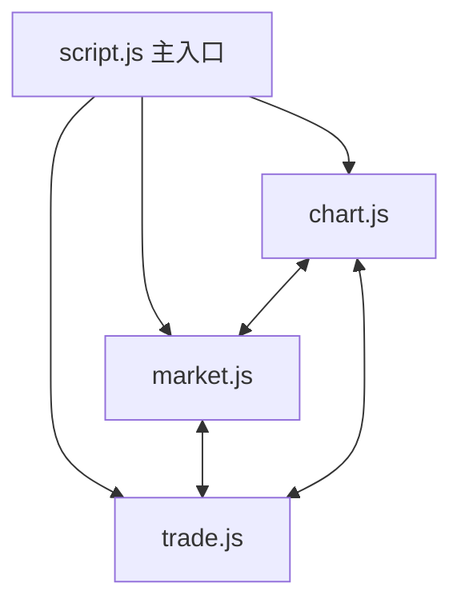

# 前端 `script.js` 模組拆分計畫

---

## 目標
將肥大的 `script.js` 拆分為三個專責模組，提升結構清晰度與可維護性。

---

## 模組劃分

### 1. `chart.js`
- **負責內容**
  - `initChart()`
  - `fetchAndApplyKlineData()`
  - `parseCSV()`
  - `parseXLSX()`
  - `applyTradeMarks()`
  - `klinecharts.registerOverlay()`

### 2. `market.js`
- **負責內容**
  - `connectBackendWebSocket()`
  - `handleBackendWsMessage()`（行情相關）
  - `handleTickData()`

### 3. `trade.js`
- **負責內容**
  - `fetchInitialData()`
  - `updateAccountPanel()`
  - `fetchAndSetCurrentLeverage()`
  - `handleChangeLeverage()`
  - `placeMarketOrder()`
  - `handleClosePosition()`
  - `makePriceEditable()`
  - `setStopOrder()`

---

## 共享狀態
- `currentSymbol`
- `backendWs`
- `klineChart`
- `positionInfo`
- `currentMarkPrice`
- `quantityPrecision`
- `pricePrecision`
- `currentLeverage`

**建議**：封裝成 `window.globalState` 物件，供三個模組共用。

---

## 主入口 `script.js`
- 引入三個模組
- 初始化應用
- 設置事件監聽器
- 協調模組間交互

---

## HTML 調整
```html
<script src="chart.js"></script>
<script src="market.js"></script>
<script src="trade.js"></script>
<script src="script.js"></script> <!-- 主入口 -->
```

---

## Mermaid 模組架構圖


---

## 預期效益
- **分工明確**，圖表、行情、交易互不干擾
- **易於維護**，未來擴充或除錯更方便
- **可重用性**，部分模組可獨立測試或重用

---

## 下一步
- 根據此計畫，設計三個模組的內容
- 重構主入口 `script.js`
- 逐步拆分並測試